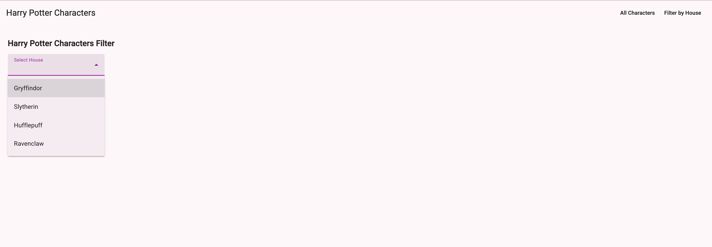
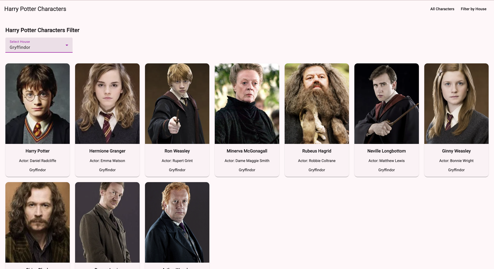
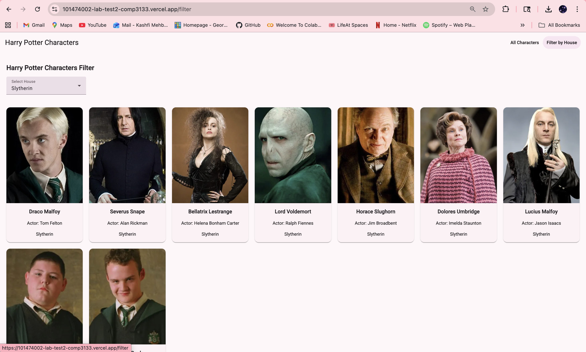
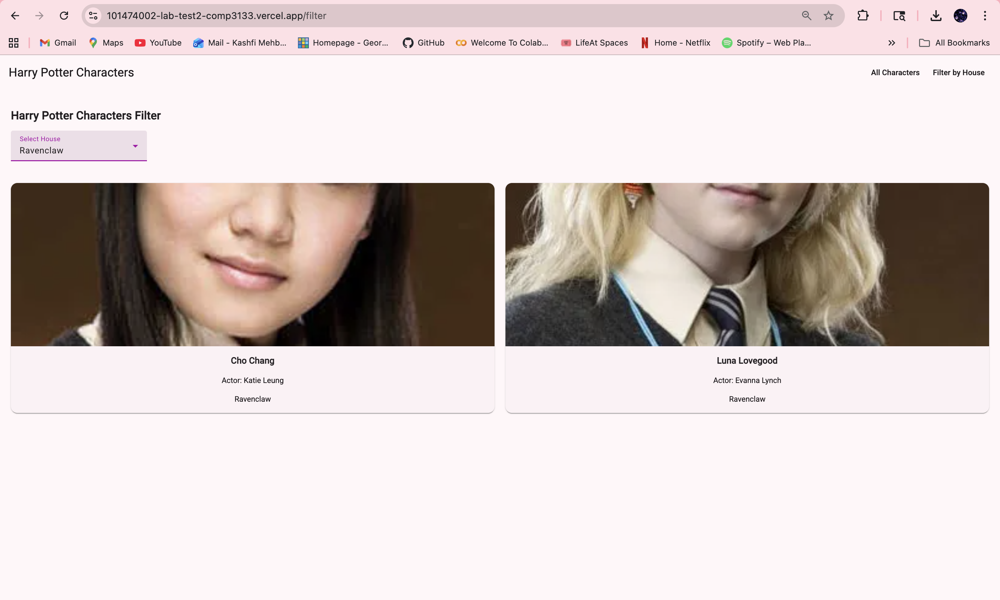
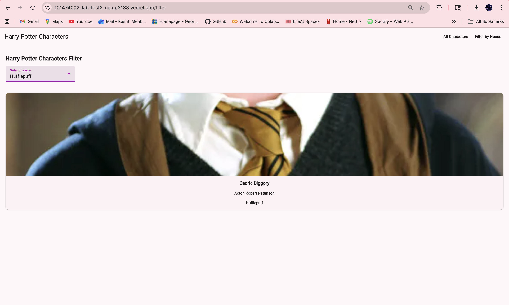
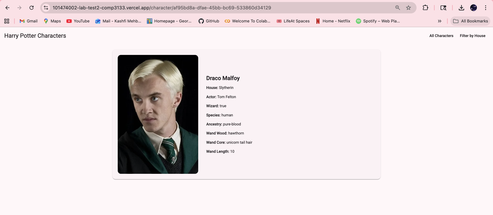
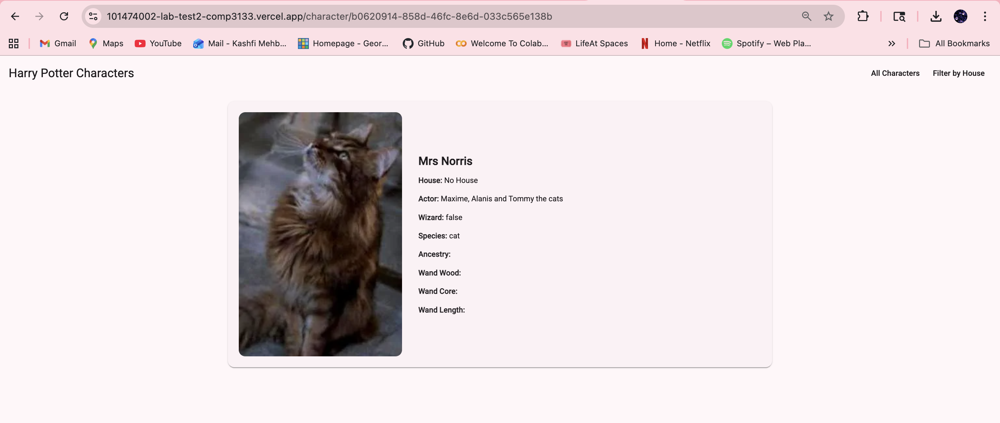
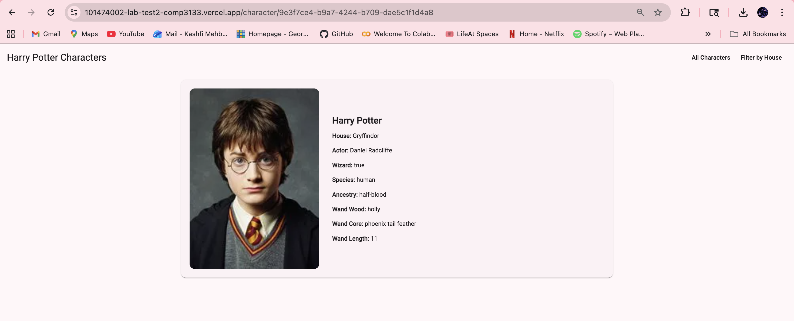

# 101474002 Lab Test 2 Comp3133

## Local Deployment

To start a local development server, run:

```bash
ng serve
```

Once the server is running, open your browser and navigate to `http://localhost:4200/`. The application will automatically reload whenever you modify any of the source files.

## Vercel Deployment

To run the vercel deployment: 

https://101474002-lab-test2-comp3133.vercel.app/characters

## App Description

This is a Harry Potter Character Explorer Angular web application which allows user to browse and interact with data from the Harry Potter API.

## App Features

The app displays a list of characters with their name, house, and image, and also provides a house-based filter so users can view characters from specific Hogwarts houses such as Gryffindor, Slytherin, Hufflepuff, and Ravenclaw.

Users can click on any character to view a detailed profile page containing additional information such as species, ancestry, wizard status, wand details, actor name, and character image.

## App Screenshots

**All Characters**


**All Characters Continued**


**Filter_by_House**



**Filter by Gryffindor**



**Filter by Slytherin**



**Filter by Ravenclaw**



**Filter by Hufflepuff**



**Character Details**








